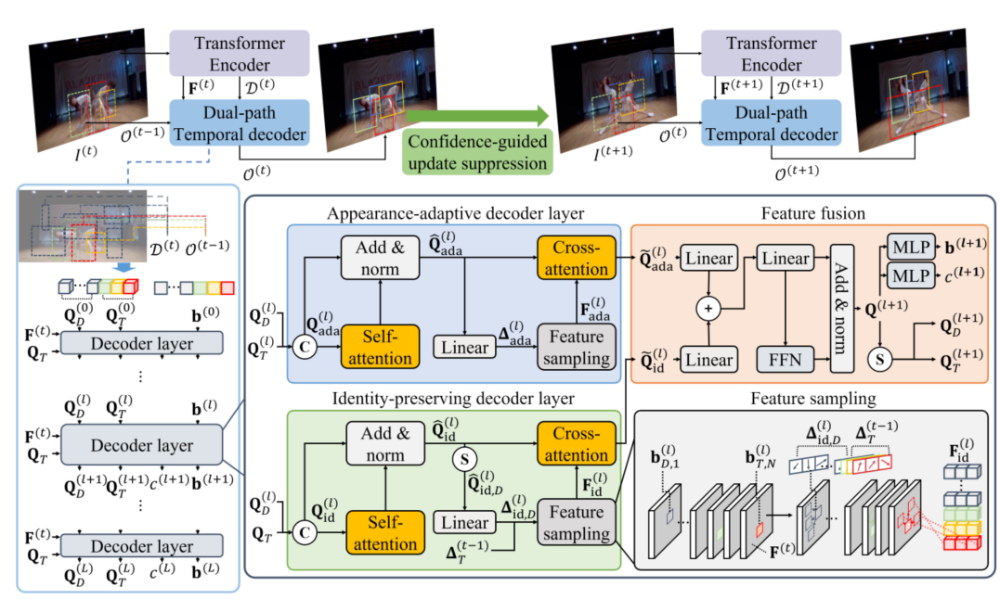

# DualTemporalMOT
# [NeurIPS 2025] Dual-Path Temporal Decoder for End-to-End Multi-Object Tracking
#### We propose a dual-path temporal decoder that explicitly separates appearance adaptation and identity preservation. The appearance-adaptive decoder dynamically updates query features using current frame information, while the identity-preserving decoder freezes query features and reuses historical sampling offsets to maintain long-term temporal consistency.

<p align="center"></p>

# Dual-Path Temporal Decoder for End-to-End Multi-Object Tracking

This repository is the official implementation of Dual-Path Temporal Decoder for End-to-End Multi-Object Tracking 

## Requirements
- Install pytorch using conda
```setup
  conda create -n DualTemporalMOT python=3.9
  conda activate DualTemporalMOT
  conda install pytorch==2.0.0 torchvision==0.15.0 torchaudio==2.0.0 pytorch-cuda=11.8 -c pytorch -c nvidia
```
- Install requirements:

```setup
  pip install Cython
  pip install -r requirements.txt
```
- Compiling CUDA operators
``` bash
  cd models/dino/ops
  python setup.py build install
  # test (should see all checking is True)
  python test.py
  cd ../../..
```
## Data preparation

Download [MOT17](https://motchallenge.net/), [CrowdHuman](https://www.crowdhuman.org/), [DanceTrack](https://dancetrack.github.io/), [SportsMOT](https://github.com/MCG-NJU/SportsMOT) and unzip them under `DualtemporalMOT_HOME` as follows:

```
mot_files
   |——————dataset
   |        └——————crowdhuman
   |                  └—————annotation_train.odgt
   |                  └—————annotation_val.odgt
   |                  └—————images
   |        └——————dancetrack
   |                  └—————test
   |                  └—————train
   |                  └—————val
   |        └——————MOT17
   |                  └—————images
   |                          └—————train
   |                          └—————test
   |        └——————sportsmot
   |                  └—————test
   |                  └—————train
   |                  └—————val
   └——————models
   |         └——————dino
   |         └——————dino_e2e

```
  
## Training

Pretraining encoder model : This model is used to initialize transformer encoder.

```shell
  cd <DualTemporalMOT_HOME>
  torchrun --nproc_per_node 8 mot.py --save_log --output_dir your_folder_name --options use_mea=False dataset_file=dancetrack_mix_ablation config_file=config/TBD/single_class.py
```
and then place the pretrained encoder model in the `mot_files/models/dino_e2e` directory and rename the file to `4scale_ablation_res_dancetrack.pth`.
To train tracking model(s) in the paper, run this command:

```shell
  cd <DualTemporalMOT_HOME>
  torchrun --nproc_per_node 8 mot.py --save_log --output_dir your_folder_name --options use_mea=False dataset_file=dancetrack_mix_ablation config_file=config/E2E/e2e_submit_dance.py
```
All hyperparameters are set according to the values defined in the configuration file.

## Evaluation

To evaluate my model on DanceTrack, run:

```eval
  torchrun --nproc_per_node 1 mot.py --eval --resume your_pth_files --save_log --output_dir your_folder_name --options use_mea=False dataset_file=dancetrack_mix_ablation config_file=config/E2E/e2e_submit_dance.py
```
All hyperparameters are set according to the values defined in the configuration file.
## Pre-trained Models

You can download pretrained models and should place in the target folder.

| Model    | Target folder  |
|------------|-------|
|[checkpoint0033_4scale](https://drive.google.com/drive/folders/1qD5m1NmK0kjE5hh-G17XUX751WsEG-h_)|mot_files/models/dino|
|[Our pretrained encoder model](https://drive.google.com/drive/folders/1RLPgSZmNYksVIC1ZgpTLNKgq4kEYohgK?usp=drive_link)|mot_files/models/dino_e2e|
|[Our pretrained tracking model](https://drive.google.com/drive/folders/1RLPgSZmNYksVIC1ZgpTLNKgq4kEYohgK?usp=drive_link)|your folder|
    


## Results

Our model achieves the following performance on :

### [Multi-Object Tracking on Dancetrack](https://codalab.lisn.upsaclay.fr/competitions/5830#results)

| Model name         | Train data | HOTA  | DetA | AssA | MOTA | IDF1 | 
| ------------------ |---------------- | -------------- | -------------- |  -------------- |  -------------- | -------------- |
| DualTemporalMOT   | crowdhuman + train | 74.1 | 83.9 | 65.6 | 92.5 | 78.6 |
| DualTemporalMOT   | crowdhuman + train + val | 76.2 | 85.0 | 68.3 | 92.5 | 79.9 |

### [Multi-Object Tracking on MOT17](https://motchallenge.net/method/MOT=9623&chl=10)

| Model name         | Train data | HOTA  | DetA | AssA | MOTA | IDF1 | 
| ------------------ |---------------- | -------------- | -------------- |  -------------- |  -------------- | -------------- |
| DualTemporalMOT   | crowdhuman + train | 61.5 | 60.8 | 62.5 | 73.8 | 75.1 |

### [Multi-Object Tracking on SportsMOT](https://codalab.lisn.upsaclay.fr/competitions/12424#results)

| Model name         | Train data | HOTA  | DetA | AssA | MOTA | IDF1 | 
| ------------------ |---------------- | -------------- | -------------- |  -------------- |  -------------- | -------------- |
| DualTemporalMOT   | train | 73.9 | 82.2 | 66.6 | 91.5 | 78.7 |
| DualTemporalMOT   | train + val | 76.7 | 84.5 | 69.6 | 94.8 | 82.5 |


## Contributing
This project is licensed under the MIT License.  
For more details, please refer to the [LICENSE](./LICENSE) file.
